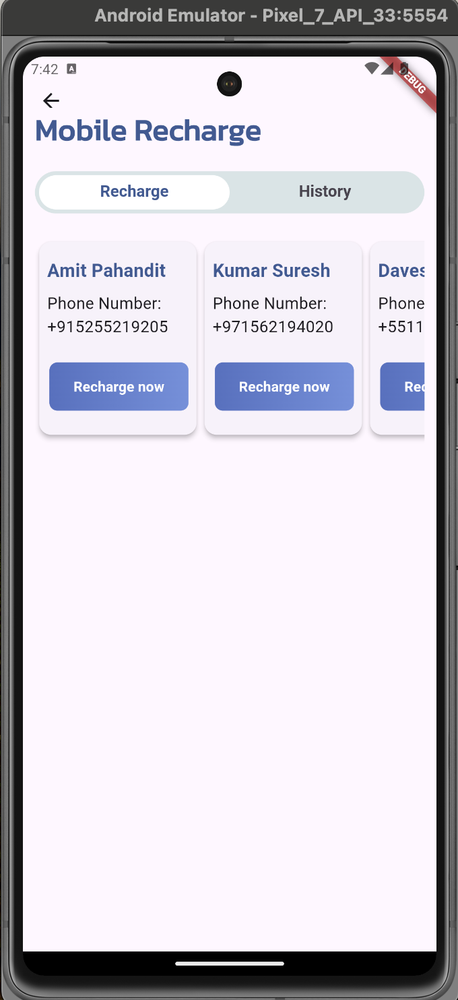

# Mobile Application - Top-Up Beneficiaries Management

Author: Daves Balthazar

## Technical Assessment

### Role:
Senior Flutter Developer

### Timeline:
Deadline: 1 week from receipt date.

### Worked days/hours:
Monday: 2 hours
Saturday: 8 hours
Sunday: 4 hours

### Objective:
Build a production-ready frontend solution for the application, enabling users to efficiently manage their top-up beneficiaries, explore available top-up options, and execute top-up transactions for their UAE phone numbers.

## Context:
At Edenred, we provide financial inclusion services for underbanked employees in the UAE where we provide each employee with a card that they receive their salary on and a mobile application where they can see their balance and enjoy value-added services.

## User Story:
As a user of the Edenred mobile application, I want to top up my UAE phone numbers with credit so I can make local phone calls.

## Acceptance Criteria:
- The user can add a maximum of 5 active top-up beneficiaries.
- Each top-up beneficiary must have a nickname with a maximum length of 20 characters.
- The user should be able to view available top-up beneficiaries.
- The user should be able to view available top-up options (AED 5, AED 10, AED 20, AED 30, AED 50, AED 75, AED 100).
- If a user is not verified, they can top up a maximum of AED 1,000 per calendar month per beneficiary for security reasons.
- If a user is verified, they can top up a maximum of AED 500 per calendar month per beneficiary.
- The user can top up multiple beneficiaries but is limited to a total of AED 3,000 per month for all beneficiaries.
- A charge of AED 1 should be applied for every top-up transaction.
- The user can only top up with an amount equal to or less than their balance.
- The user's balance should be debited first before the top-up transaction is attempted.

## UI Requirement:
The user needs to see their existing beneficiaries in a horizontal list view with cards.
- User will be able to swipe left and right in the control to navigate through all beneficiaries.
- Each beneficiary card will consist of the nickname, phone number, and a call-to-action (CTA) to navigate the user to the top-up screen.
- User is expected to see the first two cards in full and at least 20% of the 3rd card. Minimum 20% of the 3rd card should be visible in all screen sizes.

<video src="assets/design/video.mp4" width="1080" height="1920" controls></video>

## Additional Notes:
- The user's verification status is assumed to be handled through a separate feature that is not within the scope of this user story. You can assume the verification flag is one of the properties of the user entity.
- The backend will be an HTTP service responsible for providing real-time user data. You can mock the HTTP client for this service.
- The method of persistence for mobile app data is flexible and will not be assessed.
